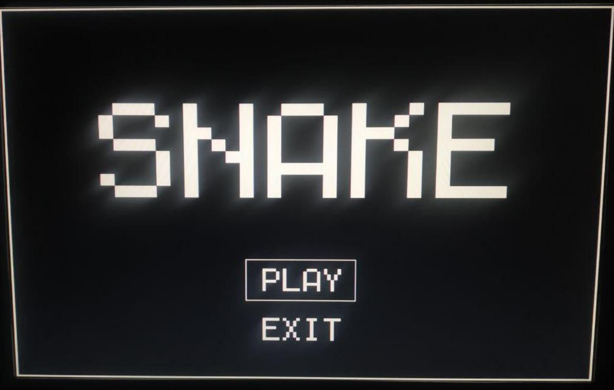

# Snake
Implementazione di Snake su Raspberry Pi 3 B+ in Forth e Assembly

## Struttura Generale
La struttura del progetto si divide in due cartelle principali:
1: **Sistema operativo:** Contiene i file necessari per il funzionamento del sistema (es. bootcode, kernel, ecc.).
2: **Snake:** Contiene i file sorgenti del gioco (in linguaggi come Forth e Assembly) e uno script per la compilazione.

I file sono suddivisi in:
- **File generici:** Librerie riutilizzabili (es. funzioni di stampa, gestione del timer, ricezione dati).
- **File specifici:** Codice specifico per il gioco Snake.
- **File Assembly:** Ottimizzazioni per la stampa su schermo.

## Installazione
Hardware richiesto:
- Raspberry Pi 3 B+.
- Modulo seriale FT232RL.
- Ricevitore infrarossi VS1838B e telecomando.
- MicroSD e jumper.

Software richiesto:
- Sistema operativo pijForthos.
- Tool di comunicazione seriale (es. picocom e minicom).

La configurazione prevede:
- Copiare i file necessari nella microSD.
- Collegare i moduli hardware seguendo le istruzioni fornite.
- Avviare e caricare il gioco con comandi terminale.

## Funzioni Principali
File generici
- **print_functions.f:** Gestione grafica (stampa di pixel, caratteri e numeri).
- **timer.f:** Timer per il conteggio del tempo di gioco.
- **receiver.f:** Ricezione e decodifica dei segnali dal telecomando.

File specifici:
- **snake.f:** Gestione del serpente (movimento, collisioni, crescita).
- **interfaces.f:** Schermate di gioco (menu principale, gioco, game over).
- **main.f:** Logica principale per avviare e controllare il gioco.

File Assembly:
- **print_pixel.s:** Ottimizzazione della stampa di rettangoli.
- **print_char.s:** Stampa di caratteri.

## Adattamento
Configurazione per adattare il codice a vari telecomandi tramite l’inizializzazione di specifiche variabili.
Uso del metodo SAMPLES per campionare segnali IR e identificare i pulsanti.

## Immagini del gioco
Avvio del gioco:

In gioco:

Fine del gioco:

